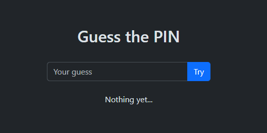

# 📌 Pinned



Guess a randomly generated PIN!

## 🥪 Tech Stack

- 🖥 [Go](https://go.dev) for the server
- 🗃️ [Redis](https://redis.io)/[Valkey](https://valkey.io) for the database
- 👀 [Bootstrap](https://getbootstrap.com) for the frontend

## 🫳 Usage

### 🐋 Docker

We provide a [Compose](./compose.yaml) config:

```sh
docker compose up
```

This will start the database and server as containers, and you may access the app at <http://localhost:8080>

### 🧑‍💻 Yourself

Ensure you have a Redis instance running, and start the server:

```sh
go run ./cmd
```

## ⚙️ Configuration

Configuration is done through environment variables.

| Variable    | Description                    | Default |
| ----------- | ------------------------------ | ------- |
| `ADDR`      | The address to listen on.      | `:8080` |
| `REDIS_URL` | The URL of the Redis instance. | `:6379` |
